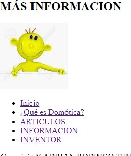

| Primero se crea el repositorio en github con el nombre “Practica-1-Mi-blog”. Una vez creado el repositorio asignamos las carpetas que vayamos a utilizar y empezamos creando el index.html para que esta sea una página principal con una breve explicación del contenido. |
|----------------------------------------------------------------------------------------------------------------------------------------------------------------------------------------------------------------------------------------------------------------------------|

Colocar Un Video de Youtube
===========================

>   Es muy sencillo poder colocar un video de youtube al html, ya que solo es
>   necesario copiar el enlace que nos facilita la misma pagina y pegarlo en el
>   visual studio.

>   De la siguiente manera.

>   Se puede observar que se coloco de manera exitosa el video en la pagina
>   realizada.

TABLA
=====

>   Se debe crear una tabla,para poder brindar de mejor manera una información
>   por lo que para poder realizarla se necesita del siguiente fragmento de
>   etiquetas.

>   Se obtienen los siguientes resultados:

>   Se ha cumplido el orden de realizar una tabla informativa.

Se pide que una de las páginas tenga al menos dos secciones () con tres artículos () cada sección. Luego, cada sección debe tener un encabezado (), en donde, se ubicaran enlaces que permitan navegar entre los artículos usando id’s.
=======================================================================================================================================================================================================================================

>   Con el siguientes fragmentos de etiquetas se va realizando acorde se pide en
>   el enunciado

Manejar listas ordenadas o desordenadas con al menos cinco ítems.
=================================================================

>   Para cumplir con este punto se opto por realizar las siguientes fragmentos
>   de etiquetas por el que se utilizo lo siguiente.

validación de cada página HTML
==============================

>   **La herramienta w3c validator nos ayuda a tener un buen desarrollo de la
>   pagina por lo que es importante utilizarlo de buena manera y se optuvo los
>   siguientes resultadps**

>   **Index.html**

>   **Domótica.htm**

>   **Productos.html**

>   En el caso de Productos.html,fue un caso particular ya que el validador nos
>   decia que era mas optimo utilzar css para realizar la tarea.

Informacion.html
================

>   **Inventor**

>   **Seguridad**

| **AGREGAR FOOTER.** Se tiene realizada la siguiente etiqueta. |
|---------------------------------------------------------------|

**En el informe se debe incluir la información de GitHub (usuario y URL del
repositorio de la práctica)**

Usuario: AdrianTene38

<https://github.com/AdrianTene38/Practica01_Mi-Blog>

**En el informe se debe incluir la información de GitHub (usuario y URL del
repositorio del Tutorial 01 - Curbside Thai)**

Usuario: AdrianTene38

<https://github.com/AdrianTene38/Tutorial-01---Curbside-Thai>
